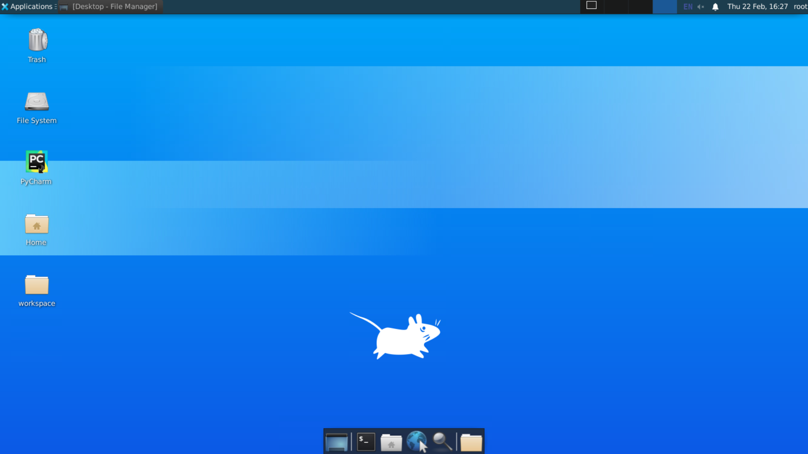
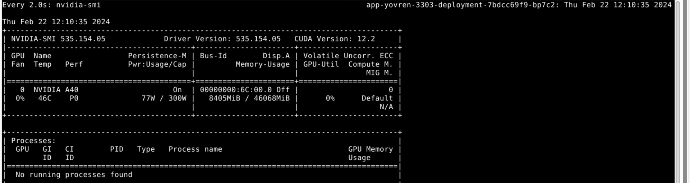
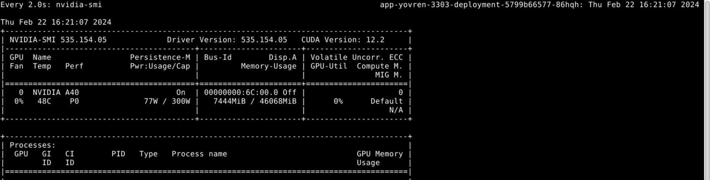
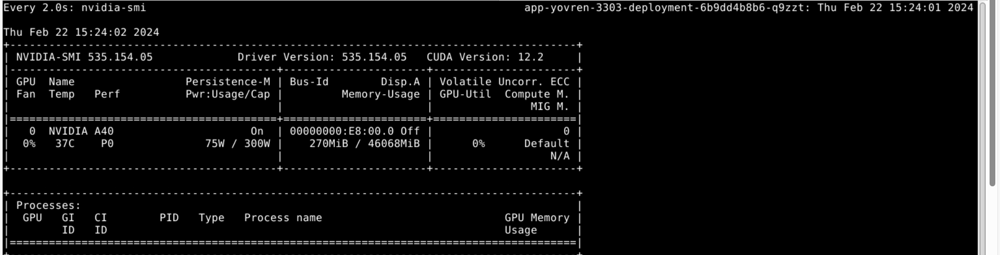
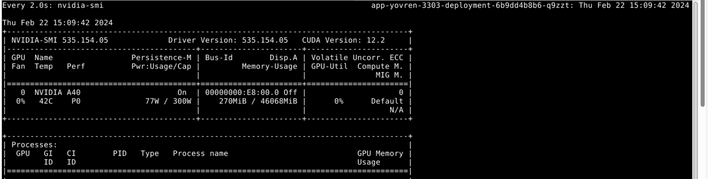

# 基于Alpaca-Lora的LLaMA 7B高效微调

## 一、实验介绍

### 1.1 实验概述

大型语言模型是一类参数数量庞大的神经网络模型，用于自然语言处理任务，如文本生成、语言理解等。LLaMA-7B是其中之一，拥有巨大的参数规模，但在进行微调时需要考虑内存占用和性能优化的问题。

微调是指在预训练模型的基础上，通过使用特定任务的数据集进行有监督学习，从而提高模型性能。在大型语言模型领域，微调是一种常见的技术，用于适应模型到特定领域或任务。然而，微调非常大的模型非常昂贵，LoRA（Low-Rank Adaptation）是一种模型微调技术，通过低秩适应层实现大型语言模型的微调。

### 1.2 实验目标

* 了解LoRa的微调方式
* 了解大模型的训练和推理过程

### 1.3 预备知识

* 了解大语言模型的基本原理。
* 了解LoRa的基本原理。
* 掌握python和pytorch的基本使用。

## 二、实验内容

### 2.1 实验准备

当前云桌面实验环境中，已准备好了下述所有的实验材料。

#### 2.1.1 环境准备

* 操作系统: Ubuntu20.04
* CPUs：1个节点，32核CPU，128GB 内存
* GPUs：1张A40，40GB显存
* Python：3.9，所需依赖提供在requirements.txt中
* IDE：PyCharm开发环境，双击桌面快捷方式即可启动


#### 2.1.2 数据集准备

* 数据集直接使用alpaca-lora项目提供的alpaca_data.json、alpaca_data_cleaned_archive.json或alpaca_data_gpt4.json
* 数据集在实验目录下

#### 2.1.3 模型准备

* 实验提供转换好的LLaMA-7B大模型的Huggingface Transformers格式，可直接进行实验
* 大模型位置在"/mnt/model/llama-7b-hf0527"

### 2.2 模型微调

在实验中，我们将使用LoRA进行微调。以下是微调的基本命令：

```bash
python finetune.py \
--base_model '/mnt/model/llama-7b-hf0527' \
--data_path './mini_data.json' \
--output_dir './lora-alpaca' \
--batch_size 2 \
--micro_batch_size 1 \
--val_set_size 2 \
```



### 2.3 模型推理

运行下面的脚本会启动一个gradio服务，可以通过浏览器在网页上进行测试。

```bash
python generate.py \
    --load_8bit \
    --base_model '/mnt/model/llama-7b-hf0527' \
    --lora_weights './lora-alpaca '
```


推理效果如下




### 2.4 权重合并

合并微调后的权重是为了优化模型的推理性能。下面是合并权重的两种方法。

## 2.4.1 用merge_and_unload方法合并权重导出为hf格式文件

该方法直接将基于 Llama 模型的 Peft 模型进行初始化，利用模型的用merge_and_unload方法合并权重后用torch.save保存为hf格式文件。

```python
import os
import torch
from peft import PeftModel
from transformers import LlamaForCausalLM, LlamaTokenizer

base_model_path = "/mnt/model/llama-7b-hf0527"
lora_model_path = "./lora-alpaca"
output_dir = "./alpaca-lora-hf"

# Original method without offloading
base_model = LlamaForCausalLM.from_pretrained(
	base_model_path,
	#load_in_8bit=False,
	torch_dtype=torch.bfloat16,
	device_map={"": "cpu"},
)

lora_model = PeftModel.from_pretrained(
	base_model,
	lora_model_path,
	device_map={"": "cpu"},
	#torch_dtype=torch.float16,
)

tokenizer = LlamaTokenizer.from_pretrained(base_model_path)

if base_model.get_input_embeddings().weight.size(0) != len(tokenizer):
	base_model.resize_token_embeddings(len(tokenizer))
	print(f"Extended vocabulary size to {len(tokenizer)}")

print(f"Merging with merge_and_unload...")
base_model = lora_model.merge_and_unload()

tokenizer.save_pretrained(output_dir)
print("Saving to Hugging Face format...")
LlamaForCausalLM.save_pretrained(base_model, output_dir)
```



### 2.4.2 手动合并权重导出为state_dict格式文件

模型参数转换和保存的主要目的是将基于 Llama 模型的 Peft 模型进行初始化，并对模型的参数进行一些调整和转换，最后保存成新的状态字典和参数文件，主要分为以下几个步骤：

1. **模型加载与初始化：**
   * 通过 `LlamaTokenizer.from_pretrained` 和 `LlamaForCausalLM.from_pretrained` 分别加载 Llama 模型的 tokenizer 和基础模型。
   * 使用 `PeftModel.from_pretrained` 初始化 Peft 模型，其中使用 Llama 模型的参数作为基础模型，采用了一些配置参数。

2. **模型参数权重合并：**
   * 遍历 Peft 模型的每一层，将 self attention 的 query (`q_proj`) 和 value (`v_proj`) 的权重设置为合并（`merge_weights`）。

3. **模型状态字典处理：**
   * 通过 `translate_state_dict_key` 函数将模型的状态字典键转换为新的键，以适应 Peft 模型的结构。
   * 通过一些规则对特定键进行了重命名和重新映射。

4. **模型保存：**
   * 将处理后的新状态字典保存为 `consolidated.00.pth` 文件，这是 Peft 模型的参数文件，使用 `torch.save` 函数进行保存。
   * 将模型的一些配置参数保存为 `params.json` 文件。

```python
import json
import os

import torch
import transformers
from peft import PeftModel
from transformers import LlamaForCausalLM, LlamaTokenizer  # noqa: E402

base_model_path = "/mnt/model/llama-7b-hf0527"
lora_model_path = "./lora-alpaca"
output_dir = "./alpaca-lora-statedict"
tokenizer = LlamaTokenizer.from_pretrained(base_model_path)

base_model = LlamaForCausalLM.from_pretrained(
    base_model_path,
    load_in_8bit=False,
    torch_dtype=torch.float16,
    device_map={"": "cpu"},
)

lora_model = PeftModel.from_pretrained(
    base_model,
    lora_model_path,
    device_map={"": "cpu"},
    torch_dtype=torch.float16,
)

# merge weights
for layer in lora_model.base_model.model.model.layers:
    layer.self_attn.q_proj.merge_weights = True
    layer.self_attn.v_proj.merge_weights = True

lora_model.train(False)

lora_model_sd = lora_model.state_dict()

params = {
    "dim": 4096,
    "multiple_of": 256,
    "n_heads": 32,
    "n_layers": 32,
    "norm_eps": 1e-06,
    "vocab_size": -1,
}
n_layers = params["n_layers"]
n_heads = params["n_heads"]
dim = params["dim"]
dims_per_head = dim // n_heads
base = 10000.0
inv_freq = 1.0 / (
    base ** (torch.arange(0, dims_per_head, 2).float() / dims_per_head)
)

def permute(w):
    return (
        w.view(n_heads, dim // n_heads // 2, 2, dim)
        .transpose(1, 2)
        .reshape(dim, dim)
    )

def unpermute(w):
    return (
        w.view(n_heads, 2, dim // n_heads // 2, dim)
        .transpose(1, 2)
        .reshape(dim, dim)
    )

def translate_state_dict_key(k):  # noqa: C901
    k = k.replace("base_model.model.", "")
    k = k.replace("base_layer.", "")
    if k == "model.embed_tokens.weight":
        return "tok_embeddings.weight"
    elif k == "model.norm.weight":
        return "norm.weight"
    elif k == "lm_head.weight":
        return "output.weight"
    elif k.startswith("model.layers."):
        layer = k.split(".")[2]
        if k.endswith(".self_attn.q_proj.weight"):
            return f"layers.{layer}.attention.wq.weight"
        elif k.endswith(".self_attn.k_proj.weight"):
            return f"layers.{layer}.attention.wk.weight"
        elif k.endswith(".self_attn.v_proj.weight"):
            return f"layers.{layer}.attention.wv.weight"
        elif k.endswith(".self_attn.o_proj.weight"):
            return f"layers.{layer}.attention.wo.weight"
        elif k.endswith(".mlp.gate_proj.weight"):
            return f"layers.{layer}.feed_forward.w1.weight"
        elif k.endswith(".mlp.down_proj.weight"):
            return f"layers.{layer}.feed_forward.w2.weight"
        elif k.endswith(".mlp.up_proj.weight"):
            return f"layers.{layer}.feed_forward.w3.weight"
        elif k.endswith(".input_layernorm.weight"):
            return f"layers.{layer}.attention_norm.weight"
        elif k.endswith(".post_attention_layernorm.weight"):
            return f"layers.{layer}.ffn_norm.weight"
        elif k.endswith("rotary_emb.inv_freq") or "lora" in k:
            return None
        else:
            print(layer, k)
            raise NotImplementedError
    else:
        print(k)
        raise NotImplementedError

new_state_dict = {}
for k, v in lora_model_sd.items():
    new_k = translate_state_dict_key(k)
    if new_k is not None:
        if "wq" in new_k or "wk" in new_k:
            new_state_dict[new_k] = unpermute(v)
        else:
            new_state_dict[new_k] = v

os.makedirs(output_dir, exist_ok=True)

torch.save(new_state_dict, output_dir+"/consolidated.00.pth")

with open(output_dir+"/params.json", "w") as f:
    json.dump(params, f)
```



## 三、实验任务

请完成以下2个实验任务，并撰写并提交Word版或PDF版实验报告。实验报告中至少需包含如下内容：

* 任务1的实现思路。
* 任务1的实现代码及详细说明。
* 任务1的运行截图及详细说明。
* 任务2的实现思路。
* 任务2的实现代码及详细说明。
* 任务2的运行截图及详细说明。
* 实验总结与感悟。

### 3.1 任务1：不同权重合并方式的效果对比

任务1的目标是比较两种不同推理方式的推理效果，并与不合并权重方式对比分析其效果，我们将通过以下步骤实现：

* 使用微调前的原始权重文件进行推理。
* 使用手动合并后的state_dict权重文件进行推理。
* 使用merge_and_unload()方法合并后得到的hf权重文件进行推理。
* 通过对比这三种方式的推理结果，评估它们在生成文本质量和性能方面的差异。

### 3.2 任务2：LoRA版微调和QLoRA版微调性能对比

任务2旨在比较LoRA版微调和QLoRA版微调在不同数据规模下的性能和加速比。QLoRA是在LoRA基础上提出的量化微调方法，能够在极低的比特数下实现模型微调，降低内存占用，并首次证明了可以在不降低任何性能的情况下微调量化为4bit的模型。此任务需要再LoRA基础上学习QLoRA的知识。我们将通过以下步骤实现：

* 使用LoRA进行微调：使用LoRA方法对预训练模型进行微调。
* 使用QLoRA进行微调：使用QLoRA方法对预训练模型进行微调。
* 调整数据规模：在两种微调方法下，分别使用不同规模的数据集进行微调。
* 观察性能对比和加速比。
