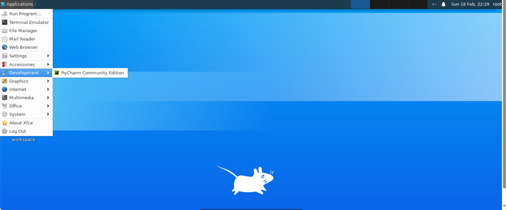
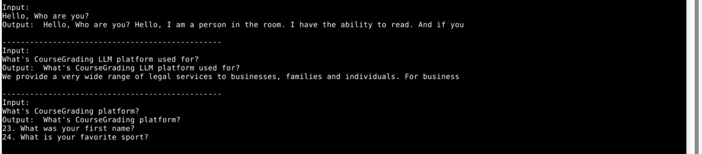
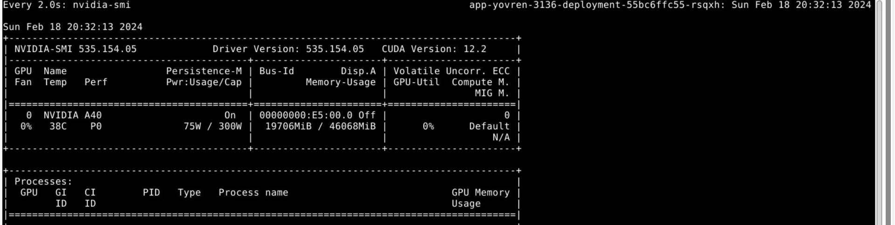
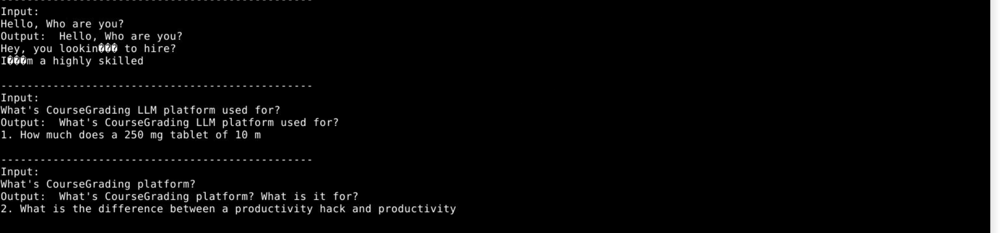
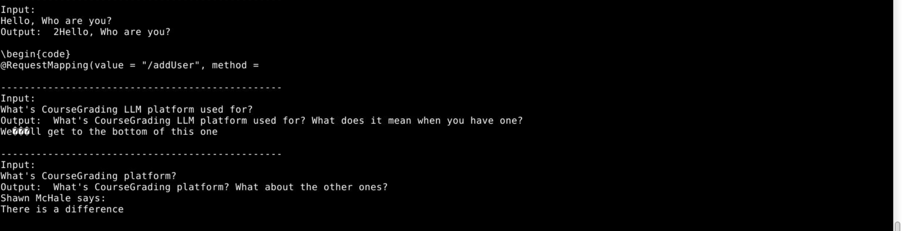
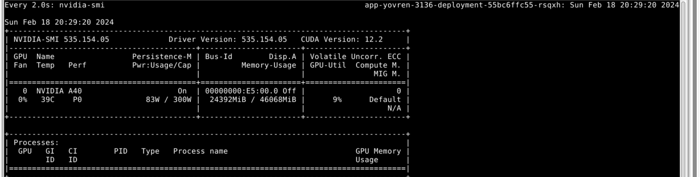

# 基于QLoRA的LLaMA-30B高效微调实战

## 一、实验介绍

### 1.1 实验概述

大型语言模型是一类参数数量庞大的神经网络模型，用于自然语言处理任务，如文本生成、语言理解等。LLaMA-30B是其中之一，拥有巨大的参数规模，但在进行微调时需要考虑内存占用和性能优化的问题。

微调是指在预训练模型的基础上，通过使用特定任务的数据集进行有监督学习，从而提高模型性能。在大型语言模型领域，微调是一种常见的技术，用于适应模型到特定领域或任务。然而，微调非常大的模型非常昂贵；以 LLaMA 65B 参数模型为例，常规的 16 bit微调需要超过 780 GB 的 GPU 内存。

LoRA（Low-Rank Adaptation）是一种模型微调技术，通过低秩适应层实现大型语言模型的微调。QLoRA则是在此基础上提出的量化微调方法，能够在极低的比特数下实现模型微调，降低内存占用，并首次证明了可以在不降低任何性能的情况下微调量化为 4 bit的模型。

### 1.2 实验目标

* 了解QLoRa的微调方式
* 了解大模型的训练和推理过程

### 1.3 预备知识

* 了解大语言模型的基本原理。
* 了解LoRa和QLoRa的基本原理。
* 掌握python和pytorch的基本使用。

## 二、实验内容

### 2.1 实验准备

当前云桌面实验环境中，已准备好了下述所有的实验材料。

#### 2.1.1 环境准备

* 操作系统: Ubuntu20.04
* CPUs：1个节点，32核CPU，128GB 内存
* GPUs：1张A40，40GB显存
* Python：3.9，所需依赖提供在requirements.txt中
* IDE：PyCharm开发环境，在"applocation->development"栏目下可以找到


#### 2.1.2 数据集准备

* 数据集直接使用alpaca-lora项目提供的alpaca_data.json、alpaca_data_cleaned_archive.json或alpaca_data_gpt4.json
* 数据集在实验目录下

#### 2.1.3 模型准备

* 实验提供转换好的LLaMA-30B大模型的Huggingface Transformers格式，可直接进行实验
* 大模型位置在"/mnt/model/llama-30b9078/"

### 2.2 模型微调

在实验中，我们将使用QLoRA进行微调。以下是微调的基本命令：

```bash
python qlora.py \
--dataset ./"mini_data.json" \
--model_name_or_path "/mnt/model/llama-30b9078/" \
--output_dir "llama-30b-qlora" \
--per_device_train_batch_size 1 \
--max_steps 1000 \
--save_total_limit 2
```

### 2.3 模型权重合并

合并微调后的权重是为了优化模型的推理性能。下面是合并权重的代码：

```python
import os
import torch
import peft
from peft import PeftModel
from transformers import LlamaForCausalLM, LlamaTokenizer

base_model_path = "/mnt/model/llama-30b9078/"
lora_model_path = "llama-30b-qlora/checkpoint-2/adapter_model/"
output_dir = "llama-30b-merge"

# Original method without offloading
base_model = LlamaForCausalLM.from_pretrained(
	base_model_path,
	#load_in_8bit=False,
	torch_dtype=torch.bfloat16,
	device_map={"": "cpu"},
)

lora_model = PeftModel.from_pretrained(
	base_model,
	lora_model_path,
	device_map={"": "cpu"},
	#torch_dtype=torch.float16,
)

tokenizer = LlamaTokenizer.from_pretrained(base_model_path)

if base_model.get_input_embeddings().weight.size(0) != len(tokenizer):
	base_model.resize_token_embeddings(len(tokenizer))
	print(f"Extended vocabulary size to {len(tokenizer)}")

print(f"Merging with merge_and_unload...")
base_model = lora_model.merge_and_unload()

tokenizer.save_pretrained(output_dir)
print("Saving to Hugging Face format...")
LlamaForCausalLM.save_pretrained(base_model, output_dir)
```

### 2.4 模型推理

为了比较不同推理方式的效果，我们提供了三种推理方式的代码，分别是合并后的权重文件推理、不合并权重文件直接推理和使用merge_and_unload()方法合并权重推理。

#### 2.4.1 用合并后的权重文件推理

```python
from transformers import AutoModelForCausalLM, LlamaTokenizer
import torch

model_id = "/mnt/model/llama-30b9078/"
merge_model_id = "llama-30b-merge"

model = AutoModelForCausalLM.from_pretrained(merge_model_id, load_in_4bit=True, device_map="auto")
tokenizer = LlamaTokenizer.from_pretrained(model_id)
device = torch.device("cuda:0")

text = "Hello, my name is "
inputs = tokenizer(text, return_tensors="pt").to(device)
outputs = model.generate(**inputs, max_new_tokens=20, do_sample=True, top_k=30, top_p=0.85)
print(tokenizer.decode(outputs[0], skip_special_tokens=True))

print("\n------------------------------------------------\nInput: ")

line = input()
while line:
  inputs = tokenizer(line, return_tensors="pt").to(device)
  outputs = model.generate(**inputs, max_new_tokens=20, do_sample=True, top_k=30, top_p=0.85)
  print("Output: ",tokenizer.decode(outputs[0], skip_special_tokens=True))
  print("\n------------------------------------------------\nInput: ")
  line = input()
```




#### 2.4.2 不合并权重文件直接推理

```python
from transformers import AutoModelForCausalLM, LlamaTokenizer
import torch
from peft import PeftModel

model_id = "/mnt/model/llama-30b9078/"
lora_weights = "llama-30b-qlora/checkpoint-2/adapter_model/"

model = AutoModelForCausalLM.from_pretrained(model_id, load_in_4bit=True, device_map="auto")
model = PeftModel.from_pretrained(model, lora_weights,)
tokenizer = LlamaTokenizer.from_pretrained(model_id)
device = torch.device("cuda:0")

text = "Hello, my name is "
inputs = tokenizer(text, return_tensors="pt").to(device)
outputs = model.generate(**inputs, max_new_tokens=20, do_sample=True, top_k=30, top_p=0.85)
print(tokenizer.decode(outputs[0], skip_special_tokens=True))

print("\n------------------------------------------------\nInput: ")

line = input()
while line:
  inputs = tokenizer(line, return_tensors="pt").to(device)
  outputs = model.generate(**inputs, max_new_tokens=20, do_sample=True, top_k=30, top_p=0.85)
  print("Output: ",tokenizer.decode(outputs[0], skip_special_tokens=True))
  print("\n------------------------------------------------\nInput: ")
  line = input()
```




#### 2.4.3 用merge_and_unload()方法合并权重推理

```python
from transformers import AutoModelForCausalLM, LlamaTokenizer
import torch
from peft import PeftModel

model_id = "/mnt/model/llama-30b9078/"
lora_weights = "llama-30b-qlora/checkpoint-2/adapter_model/"

model = AutoModelForCausalLM.from_pretrained(model_id, load_in_4bit=True, device_map="auto")
model = PeftModel.from_pretrained(model,lora_weights,)
model = model.merge_and_unload()
tokenizer = LlamaTokenizer.from_pretrained(model_id)
device = torch.device("cuda:0")

text = "Hello, my name is "
inputs = tokenizer(text, return_tensors="pt").to(device)
outputs = model.generate(**inputs, max_new_tokens=20, do_sample=True, top_k=30, top_p=0.85)
print(tokenizer.decode(outputs[0], skip_special_tokens=True))

print("\n------------------------------------------------\nInput: ")

line = input()
while line:
  inputs = tokenizer(line, return_tensors="pt").to(device)
  outputs = model.generate(**inputs, max_new_tokens=20, do_sample=True, top_k=30, top_p=0.85)
  print("Output: ",tokenizer.decode(outputs[0], skip_special_tokens=True))
  print("\n------------------------------------------------\nInput: ")
  line = input()
```




## 三、实验任务

请完成以下2个实验任务，并撰写并提交Word版或PDF版实验报告。实验报告中至少需包含如下内容：

* 任务1的实现思路。
* 任务1的实现代码及详细说明。
* 任务1的运行截图及详细说明。
* 任务2的实现思路。
* 任务2的实现代码及详细说明。
* 任务2的运行截图及详细说明。
* 实验总结与感悟。

### 3.1 任务1：不同推理方式的效果对比

任务1的目标是比较三种不同的推理方式，分别是合并后的权重文件推理、不合并权重文件直接推理以及使用merge_and_unload()方法合并权重推理。我们将通过以下步骤实现：

* 使用合并后的权重文件进行推理：加载模型时直接使用合并后的权重文件进行推理。
* 不合并权重文件直接推理：加载模型时仍然使用微调前的原始权重文件进行推理。
* 使用merge_and_unload()方法合并权重进行推理：在模型加载后，使用merge_and_unload()方法将权重合并并进行推理。
* 通过对比这三种方式的推理结果，评估它们在生成文本质量和性能方面的差异。

### 3.2 任务2：LoRA版微调和QLoRA版微调性能对比

任务2旨在比较LoRA版微调和QLoRA版微调在不同数据规模下的性能和加速比。我们将通过以下步骤实现：

* 使用LoRA进行微调：使用LoRA方法对预训练模型进行微调。
* 使用QLoRA进行微调：使用QLoRA方法对预训练模型进行微调。
* 调整数据规模：在两种微调方法下，分别使用不同规模的数据集进行微调。
* 观察性能对比和加速比。
