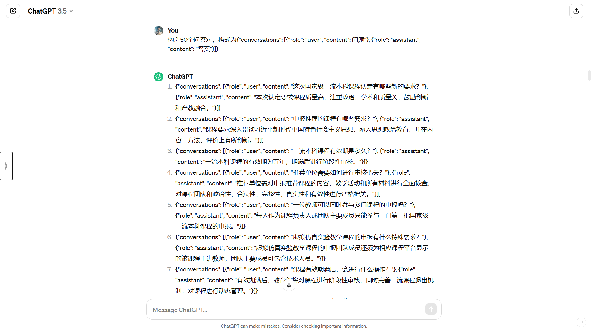
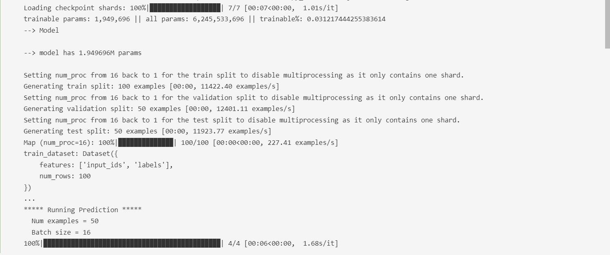
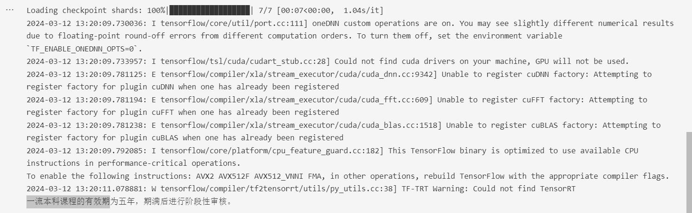
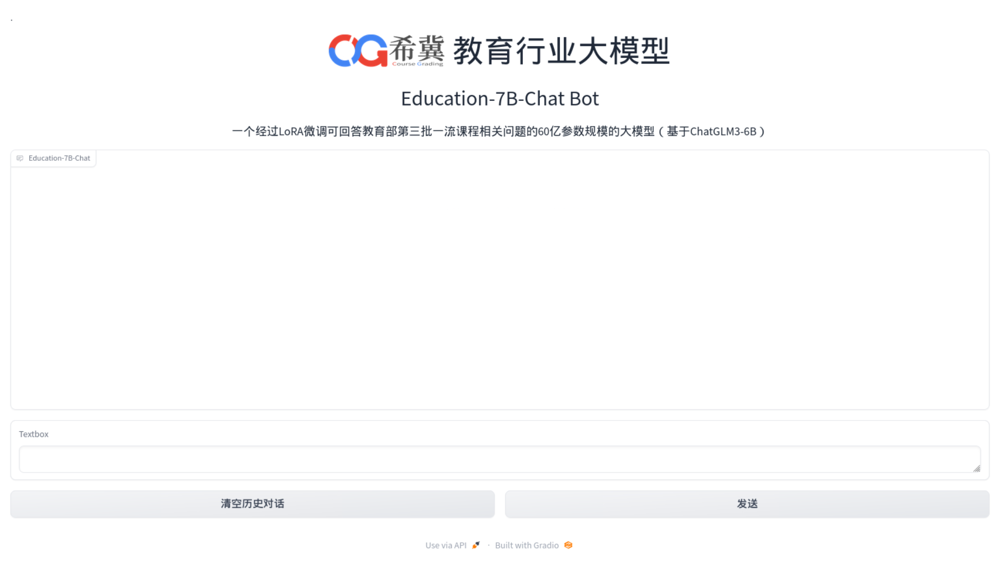
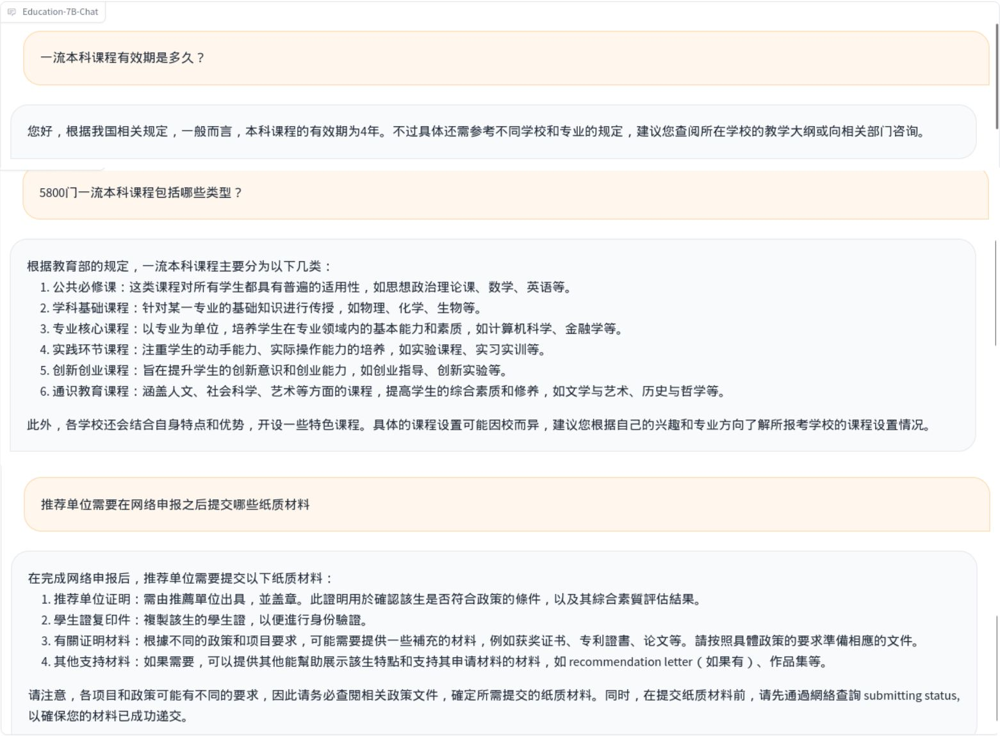

# 教育行业大模型及应用开发实战

## 一、实验介绍

### 1.1 实验概述

本实验以教育行业的《第三批国家级一流本科课程认定工作》文件为例对 ChatGLM3-6B 模型进行lora微调，使其具备文件中的知识，并且对微调后的模型进行Web展示和发布，实现对该大模型的开发实战。

### 1.2 实验目标

* 根据文件《第三批国家级一流本科课程认定工作》构建数据集
* 利用LoRa技术微调ChatGLM-6B大模型
* 利用gradio实现Web Demo并发布

### 1.3 预备知识

* 了解大语言模型的基本原理
* 了解LoRa的基本原理
* 掌握python和pytorch的基本使用

## 二、实验内容

### 2.1 实验准备

当前云桌面实验环境中，已准备好了下述所有的实验材料。

#### 2.1.1 环境准备

* 操作系统: Ubuntu20.04
* CPUs：1个节点，32核CPU，128GB 内存
* GPUs：1张A40，40GB显存
* Python：3.9，所需依赖提供在requirements.txt中，实验环境中已提前装好
* IDE：PyCharm开发环境，双击桌面快捷方式即可启动


#### 2.1.2 模型准备

* 实验提供ChatGLM-6B大模型，可直接进行实验
* 大模型位置在"/mnt/model/chatglm3-6b1012"

### 2.2 数据集构建

实验提供了文件《第三批国家级一流本科课程认定工作》的pdf文件，现在要根据文件内容设计QA对来构建数据集。

#### 2.2.1 利用ChatGPT获取QA对

考虑到所需QA对数量较多，人工实现质量不高且效率低，因此可尝试使用ChatGPT帮助提取QA对。首先需要将文件的文字提供给ChatGPT，然后输入以下提示词：

```bash
请根据文件内容构造150个问答对，格式为{"conversations": [{"role": "user", "content": 问题"}, {"role": "assistant", "content": "答案"}]}
```

最终得到的效果如下：


#### 2.2.2 构建数据集

对得到的QA对按照2:1划分为训练集和验证集分别保存到“train.json”和“dev.json”中方到"data"目录下得到最终的数据集。

### 2.3 LoRA微调与推理

本部分参考了`THUDM/ChatGLM3`的`finetune_demo`部分的代码，实验目录下所提供文件皆可在相应github中找到。

#### 2.3.1 模型微调

在实验中，我们将使用LoRA进行微调。以下是微调的基本命令：

```bash
python finetune_hf.py  data  /mnt/model/chatglm3-6b1012  configs/lora.yaml
```

其中`data`是数据集目录，`/mnt/model/chatglm3-6b1012`是模型位置，`configs/lora.yaml`则是配置文件，如需要改动可另外设置，得到实验结果如下：


#### 2.3.1 模型推理

在完成微调任务之后，我们可以查看到 `output` 文件夹下多了很多个`checkpoint-*`的文件夹，这些文件夹代表了训练的轮数。
我们选择最后一轮的微调权重，并使用inference进行导入推理。

```bash
python inference_hf.py output/checkpoint-3000/ --prompt "一流本科课程的有效期多久？"
```

其中`output/checkpoint-3000/`是微调过后的参数位置，`--prompt "一流本科课程的有效期多久？"`制定了输入的命令，如需要改动可另外设置，得到实验结果如下：


### 2.4 Web Demo

#### 2.4.1 Web Demo的开发过程

(1) 引入必要的库

```python
import os
import gradio as gr
import torch
from threading import Thread
from typing import Union, Annotated
from pathlib import Path
from peft import AutoPeftModelForCausalLM, PeftModelForCausalLM
from transformers import (
    AutoModelForCausalLM,
    AutoTokenizer,
    PreTrainedModel,
    PreTrainedTokenizer,
    PreTrainedTokenizerFast,
    StoppingCriteria,
    StoppingCriteriaList,
    TextIteratorStreamer
)
```

(2) 加载模型和分词器

```python
# 模型和分词器路径
MODEL_PATH = os.environ.get('MODEL_PATH', '/mnt/model/chatglm3-6b1012/')
TOKENIZER_PATH = os.environ.get("TOKENIZER_PATH", MODEL_PATH)
# 加载模型和分词器
def load_model_and_tokenizer(model_dir: Union[str, Path], trust_remote_code: bool = True):
    model_dir = Path(model_dir).expanduser().resolve()
    if (model_dir / 'adapter_config.json').exists():
        model = AutoPeftModelForCausalLM.from_pretrained(model_dir, trust_remote_code=trust_remote_code, device_map='auto')
        tokenizer_dir = model.peft_config['default'].base_model_name_or_path
    else:
        model = AutoModelForCausalLM.from_pretrained(model_dir, trust_remote_code=trust_remote_code, device_map='auto')
        tokenizer_dir = model_dir
    tokenizer = AutoTokenizer.from_pretrained(tokenizer_dir, trust_remote_code=trust_remote_code)
    return model, tokenizer

model, tokenizer = load_model_and_tokenizer(MODEL_PATH, trust_remote_code=True)
```

(3) 预测函数

```python
# 停止生成条件类
class StopOnTokens(StoppingCriteria):
    def __call__(self, input_ids: torch.LongTensor, scores: torch.FloatTensor, **kwargs) -> bool:
        stop_ids = [0, 2]
        for stop_id in stop_ids:
            if input_ids[0][-1] == stop_id:
                return True
        return False
# 预测函数
def predict(history):
    stop = StopOnTokens()
    messages = []
    for idx, (user_msg, model_msg) in enumerate(history):
        if idx == len(history) - 1 and not model_msg:
            messages.append({"role": "user", "content": user_msg})
            break
        if user_msg:
            messages.append({"role": "user", "content": user_msg})
        if model_msg:
            messages.append({"role": "assistant", "content": model_msg})
    print("\n\n====conversation====\n", messages)
    model_inputs = tokenizer.apply_chat_template(messages, add_generation_prompt=True, tokenize=True, return_tensors="pt").to(next(model.parameters()).device)
    streamer = TextIteratorStreamer(tokenizer, timeout=60, skip_prompt=True, skip_special_tokens=True)
    generate_kwargs = {"input_ids": model_inputs, "streamer": streamer, "max_new_tokens": 8192, "stopping_criteria": StoppingCriteriaList([stop]), "repetition_penalty": 1.2, }
    t = Thread(target=model.generate, kwargs=generate_kwargs)
    t.start()
    for new_token in streamer:
        if new_token != '':
            history[-1][1] += new_token
            yield history
```

(4) Gradio 界面和相应事件触发函数

```python
# 解析文本，用于处理 Markdown 格式
def parse_text(text):
    lines = text.split("\n")
    lines = [line for line in lines if line != ""]
    count = 0
    for i, line in enumerate(lines):
        if "```" in line:
            count += 1
            items = line.split('`')
            if count % 2 == 1:
                lines[i] = f'<pre><code class="language-{items[-1]}">'
            else:
                lines[i] = f'<br></code></pre>'
        else:
            if i > 0:
                if count % 2 == 1:
                    line = line.replace("`", "\`")
                    line = line.replace("<", "&lt;")
                    line = line.replace(">", "&gt;")
                    line = line.replace(" ", "&nbsp;")
                    line = line.replace("*", "&ast;")
                    line = line.replace("_", "&lowbar;")
                    line = line.replace("-", "&#45;")
                    line = line.replace(".", "&#46;")
                    line = line.replace("!", "&#33;")
                    line = line.replace("(", "&#40;")
                    line = line.replace(")", "&#41;")
                    line = line.replace("$", "&#36;")
                lines[i] = "<br>" + line
    text = "".join(lines)
    return text

# 创建 Gradio 界面
with gr.Blocks() as demo:
    gr.Markdown(""".<div style="display: flex; align-items: center; justify-content: center;">
                  
                  <span style="margin-left: 10px;"><font size=24>教育行业大模型</span>
              </div>""")  ## todo
    gr.Markdown("""<center><font size=6>Education-7B-Chat Bot</center>""")
    gr.Markdown("""<center><font size=4>一个经过LoRA微调可回答教育部第三批一流课程相关问题的60亿参数规模的大模型（基于ChatGLM3-6B）</center>""")
    chatbot = gr.Chatbot(label='Education-7B-Chat', elem_classes="control-height")
    user_input = gr.Textbox()
    with gr.Row():
        emptyBtn = gr.Button("清空历史对话")
        submitBtn = gr.Button("发送")
    # 用户输入处理函数
    def user(query, history):
        return "", history + [[parse_text(query), ""]]
    # 点击提交按钮的事件处理
    submitBtn.click(user, [user_input, chatbot], [user_input, chatbot], queue=False).then(predict, [chatbot], chatbot)
    # 点击清空按钮的事件处理
    emptyBtn.click(lambda: None, None, chatbot, queue=False)
```

(4) 启动 Gradio 服务器

```python
demo.queue().launch(
    server_port=8080,
    server_name="0.0.0.0",
    root_path=os.getenv("CG_APP_ROUTE_PATH"),
    file_directories=["/tmp/"]
)
```

#### 2.4.2 Web Demo的发布过程

执行下面脚本即可启动Web Demo的界面

```bash
python app.py
```



#### 2.4.3 Web Demo的测试过程

经过测试，微调前后大模型的表现对比如下所示




可以发现，经过微调后的大模型对文件内容已经集成，回答的质量有了很大的提高。

## 三、实验总结

到此位置，我们就完成了使用单张 GPU Lora 来微调 ChatGLM3-6B 模型，使其能具备给定文件的知识。通过本实验，你将学会：

1. 微调数据集的准备和对齐
2. 使用模型进行 Lora 微调
3. 使用微调的模型进行推理
4. 利用gradio开发大模型的Web展示
