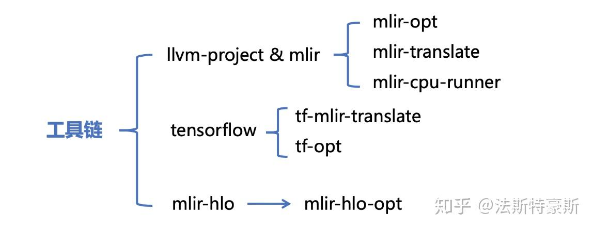
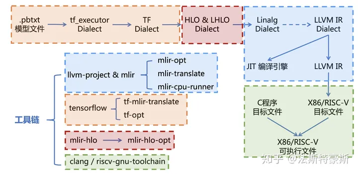

# 模型编译工具MLIR实战

## 一、实验介绍

### 1.1 实验概述

MLIR全名为多层次中间表示（Multi-Level Intermediate Representation），它是为了解决现有编译系统中IR之间转换效率和可迁移性不高的问题而诞生的。

以TensorFlow为例，为了在硬件上执行数值计算，需要一个TensorFlow的编译生态系统。传统的编译流程是先将TensorFlow图转换为XLA HLO，然后将其翻译为LLVM IR，最后编译到各种硬件的汇编语言。然而，这样的编译方式存在一些缺点，包括构建编译系统的开销较大、设计实现中存在重复部分以及IR之间缺乏迁移性等问题。为了解决这些问题，MLIR提出了一种新的方法，为各种DSL（领域特定语言）提供一种统一的中间表达形式，将它们集成为一套生态系统，以一种一致性强的方式编译到特定硬件平台的汇编语言上。通过模块化和可扩展的特点，MLIR能够解决IR之间相互配合的问题。

### 1.2 实验目标

* 了解MLIR的知识
* 利用给定环境感受MLIR的编译过程

### 1.3 预备知识

* 会使用linux操作系统

## 二、实验环境

当前云桌面实验环境中，已准备好了下述所有的实验材料。

* 操作系统: Ubuntu20.04
* 软件依赖：CMake，Ninja，Bazel (仅列出构建流程中必要的依赖，其余依赖缺少时自行安装)
* 工具链：


## 三、实验步骤

本实验的目的是使用MLIR完成一个端到端的编译过程，由于实验工具链版本不同，如果在运行过程中报错识别不了func函数，需要手动改为func.func

选用的add.pbtxt内容为

```txt
node {
  name: "Add"
  op: "Add"
  input: "input0"
  input: "input1"
  attr {
    key: "T"
    value {
      type: DT_INT32
    }
  }
}
node {
  name: "input0"
  op: "Placeholder"
  attr {
    key: "dtype"
    value {
      type: DT_INT32
    }
  }
}
node {
  name: "input1"
  op: "Placeholder"
  attr {
    key: "dtype"
    value {
      type: DT_INT32
    }
  }
}
versions {
  producer: 27
}
```

使用tf-mlir-translate工具进行翻译，其中各种选项指定了输入输出的类型以及尺寸，得到tf_executor Dialect格式的文件，命令如下

```bash
tf-mlir-translate -graphdef-to-mlir -tf-enable-shape-inference-on-import=false add.pbtxt -tf-input-arrays=input0,input1 -tf-input-data-types=DT_INT32,DT_INT32 -tf-input-shapes=10:10 -tf-output-arrays=Add -o add.mlir
```

最终得到的add.mlir文件内容为

```
module attributes {tf.versions = {bad_consumers = [], min_consumer = 0 : i32, producer = 27 : i32}} {
  func.func @main(%arg0: tensor<10xi32>, %arg1: tensor<10xi32>) -> tensor<*xi32> attributes {tf.entry_function = {control_outputs = "", inputs = "input0,input1", outputs = "Add"}} {
    %0 = tf_executor.graph {
      %outputs, %control = tf_executor.island wraps "tf.Add"(%arg0, %arg1) {device = ""} : (tensor<10xi32>, tensor<10xi32>) -> tensor<*xi32>
      tf_executor.fetch %outputs : tensor<*xi32>
    }
    return %0 : tensor<*xi32>
  }
}
```

从tf_executor Dialect转化为tf Dialect格式，命令如下

```
tf-opt -tf-executor-to-functional-conversion add.mlir -o add-func.mlir
```

得到的add-func.mlir文件内容为

```
module attributes {tf.versions = {bad_consumers = [], min_consumer = 0 : i32, producer = 27 : i32}} {
  func.func @main(%arg0: tensor<10xi32>, %arg1: tensor<10xi32>) -> tensor<*xi32> attributes {tf.entry_function = {control_outputs = "", inputs = "input0,input1", outputs = "Add"}} {
    %0 = "tf.Add"(%arg0, %arg1) {device = ""} : (tensor<10xi32>, tensor<10xi32>) -> tensor<*xi32>
    return %0 : tensor<*xi32>
  }
}
```

从tf Dialect转化为hlo Dialect格式，命令如下

```
tf-opt --tf-to-hlo-pipeline add-func.mlir -o add-mhlo.mlir
```

得到的add-mhlo.mlir文件内容为

```
module attributes {tf.versions = {bad_consumers = [], min_consumer = 0 : i32, producer = 27 : i32}} {
  func @main(%arg0: tensor<10xi32>, %arg1: tensor<10xi32>) -> tensor<10xi32> attributes {tf.entry_function = {control_outputs = "", inputs = "input0,input1", outputs = "Add"}} {
    %0 = mhlo.add %arg0, %arg1 : tensor<10xi32>
    return %0 : tensor<10xi32>
  }
}
```

从hlo Dialect转化为lhlo Dialect格式，命令如下

```
mlir-hlo-opt add-mhlo.mlir -hlo-legalize-to-lhlo -o add-lhlo.mlir
```

得到的add-lhlo.mlir文件内容为

```
module attributes {tf.versions = {bad_consumers = [], min_consumer = 0 : i32, producer = 27 : i32}}  {
  func @main(%arg0: memref<10xi32>, %arg1: memref<10xi32>) -> memref<10xi32> attributes {tf.entry_function = {control_outputs = "", inputs = "input0,input1", outputs = "Add"}} {
    %0 = alloc() : memref<10xi32>
    "lmhlo.add"(%arg0, %arg1, %0) : (memref<10xi32>, memref<10xi32>, memref<10xi32>) -> ()
    return %0 : memref<10xi32>
  }
}

```

从lhlo Dialect转化为linalg Dialect格式，命令如下

```
mlir-hlo-opt add-lhlo.mlir -lhlo-legalize-to-linalg -o add-linalg.mlir
```

得到的add-linalg.mlir文件内容为

```
#map = affine_map<(d0) -> (d0)>
module attributes {tf.versions = {bad_consumers = [], min_consumer = 0 : i32, producer = 27 : i32}}  {
  func @main(%arg0: memref<10xi32>, %arg1: memref<10xi32>) -> memref<10xi32> attributes {tf.entry_function = {control_outputs = "", inputs = "input0,input1", outputs = "Add"}} {
    %0 = alloc() : memref<10xi32>
    linalg.generic {indexing_maps = [#map, #map, #map], iterator_types = ["parallel"]} ins(%arg0, %arg1 : memref<10xi32>, memref<10xi32>) outs(%0 : memref<10xi32>) {
    ^bb0(%arg2: i32, %arg3: i32, %arg4: i32):  // no predecessors
      %1 = addi %arg2, %arg3 : i32
      linalg.yield %1 : i32
    }
    return %0 : memref<10xi32>
  }
}

```

## 三、实验任务

请完成以下2个实验任务，并撰写并提交Word版或PDF版实验报告。实验报告中至少需包含如下内容：

* 任务1的实现思路。
* 任务1的实现代码及详细说明。
* 任务1的运行截图及详细说明。
* 任务2的实现思路。
* 任务2的实现代码及详细说明。
* 任务2的运行截图及详细说明。
* 实验总结与感悟。

### 3.1 任务1：调研MLIR在大模型编译优化种的应用

MLIR作为一种新型的中间表示形式，在解决现有编译系统中IR之间转换效率和可迁移性不高的问题方面具有潜力。调研将MLIR（Multi-Level Intermediate Representation）应用于大模型编译优化的相关研究论文，并撰写一份调研报告。具体要求如下：

1. 调研MLIR在大模型编译优化领域的相关研究论文，包括但不限于将MLIR应用于深度学习模型、图神经网络等大规模模型的编译优化方面的论文。
2. 撰写调研报告，内容包括MLIR的基本原理、在大模型编译优化方面的应用案例、相关研究论文的综述分析、MLIR在该领域的优势和局限性、未来发展趋势等。


### 3.1 任务2：完成MLIR到可执行文件的转化

实验书种编译到"linalg Dialect"这个层次的文件只是计算图的函数表示，要想让计算图运行起来，我们得给它输入数据，这就是需要手动修改代码，使得代码可以运行。参考方法有两种：
1. 在MLIR文件里提供输入的数据，使用MLIR的JIT即时编译引擎执行代码 （mlir-cpu-runner）
2. 使用C程序调用MLIR的函数编译出可执行文件  